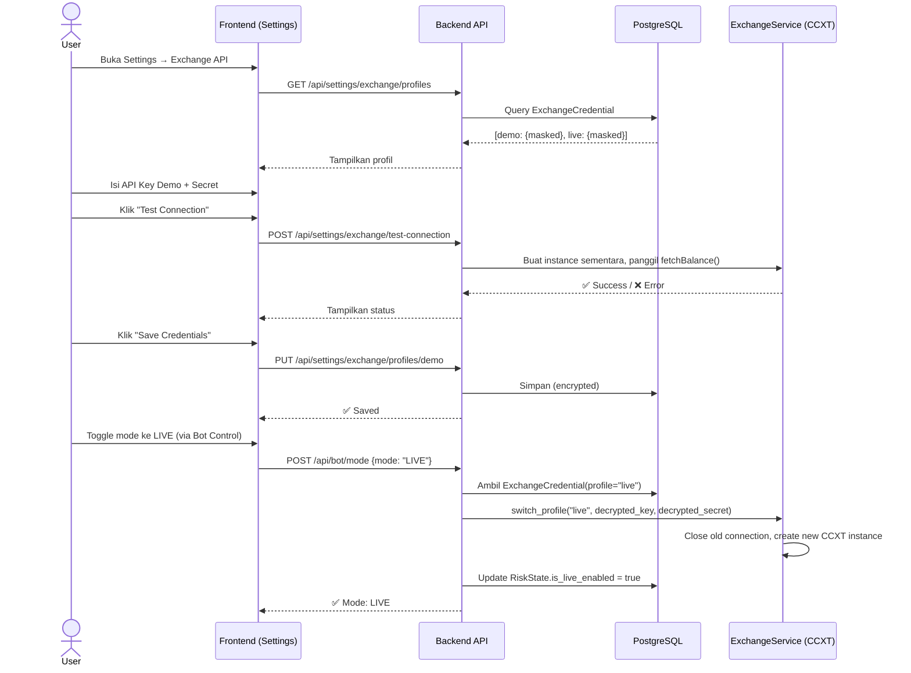

# PRD: Bybit Exchange Profile Toggle (Demo ↔ Live)

## 1. Latar Belakang

Saat ini konfigurasi exchange Bybit hanya mendukung **satu set kredensial** yang disimpan di `.env`:

```env
EXCHANGE_NAME=bybit
EXCHANGE_API_KEY=sR3NDllu2JgwqAFzPv
EXCHANGE_API_SECRET=jseU48GXtDLov9HjlFZs8VtqeNYo9BHaapnX
EXCHANGE_TESTNET=true
```

Permasalahan utama:
- API Key **Live** dan **Demo (Testnet)** Bybit digenerate dari portal yang berbeda dan nilainya berbeda.
- Flag `EXCHANGE_TESTNET=true/false` hanya mengaktifkan sandbox mode pada CCXT, **tetapi tidak mengganti API key/secret**.
- Jika user toggle dari Demo → Live melalui UI, bot tetap menggunakan API key Demo → menghasilkan **error autentikasi** atau tidak ada order yang tereksekusi.
- Endpoint REST API Bybit juga berbeda:
  - **Live**: `https://api.bybit.com`
  - **Demo/Testnet**: `https://api-demo.bybit.com` atau `https://api-testnet.bybit.com`

## 2. Tujuan

Menyediakan mekanisme **dual-profile exchange** sehingga:
1. User dapat menyimpan **dua set kredensial** (Demo & Live) secara independen.
2. Toggle mode **PAPER ↔ LIVE** pada UI secara otomatis mengganti kredensial aktif.
3. Koneksi CCXT **di-reinisialisasi** dengan API key, secret, dan endpoint yang benar setiap kali mode berubah.
4. Kredensial disimpan **terenkripsi** di database (bukan di `.env` saja).

## 3. Arsitektur Saat Ini

```
┌─────────────┐     ┌─────────────┐     ┌─────────────┐
│    .env      │────▶│  config.py   │────▶│ ExchangeSvc  │
│ (single key) │     │  (Settings)  │     │ (CCXT init)  │
└─────────────┘     └─────────────┘     └──────┬───────┘
                                               │
                    ┌──────────────┐            │
                    │  RiskState   │──── is_live_enabled ──▶ ExecutionEngine
                    │  (DB toggle) │                        (paper vs real)
                    └──────────────┘
```

**Masalah**: `RiskState.is_live_enabled` hanya mempengaruhi apakah order dikirim ke paper engine atau exchange. Tetapi **instance ExchangeService** tetap menggunakan API key yang sama dari `.env`.

## 4. Arsitektur Target

```
┌────────────────┐
│   .env (seed)  │─── Bootstrap awal (fallback)
└───────┬────────┘
        │
        ▼
┌────────────────────────────────┐
│     exchange_credentials (DB)  │
│  ┌────────────┬───────────────┐│
│  │   demo     │     live      ││
│  │ api_key    │ api_key       ││
│  │ api_secret │ api_secret    ││
│  │ base_url   │ base_url      ││
│  │ (encrypted)│ (encrypted)   ││
│  └────────────┴───────────────┘│
└────────────────┬───────────────┘
                 │
                 ▼  (berdasarkan RiskState.is_live_enabled)
        ┌────────────────┐
        │ ExchangeService │ ← di-reinisialisasi saat toggle
        │  (CCXT client)  │
        └────────────────┘
```

## 5. Komponen yang Perlu Diubah

---

### 5.1 Database — Model Baru: `ExchangeCredential`

**File**: `backend/app/models/exchange_credential.py` `[NEW]`

```python
class ExchangeCredential(Base):
    __tablename__ = "exchange_credentials"

    id        = Column(Integer, primary_key=True)
    profile   = Column(String, unique=True, index=True)  # "demo" | "live"
    exchange  = Column(String, default="bybit")           # Nama exchange
    api_key   = Column(String)                            # Terenkripsi (AES-256)
    api_secret= Column(String)                            # Terenkripsi (AES-256)
    base_url  = Column(String, nullable=True)             # Override URL jika perlu
    is_active = Column(Boolean, default=False)            # Profil yang sedang aktif
    created_at= Column(DateTime, default=datetime.utcnow)
    updated_at= Column(DateTime, onupdate=datetime.utcnow)
```

> [!IMPORTANT]
> Kolom `api_key` dan `api_secret` **wajib** dienkripsi menggunakan `ENCRYPTION_KEY` yang sudah ada di `.env`. Gunakan library `cryptography.fernet` untuk enkripsi simetris.

---

### 5.2 Backend — Encryption Service

**File**: `backend/app/core/encryption.py` `[NEW]`

Utility untuk encrypt/decrypt kredensial exchange:

```python
from cryptography.fernet import Fernet
from app.core.config import settings

_fernet = Fernet(settings.ENCRYPTION_KEY.encode())

def encrypt(value: str) -> str:
    return _fernet.encrypt(value.encode()).decode()

def decrypt(value: str) -> str:
    return _fernet.decrypt(value.encode()).decode()
```

---

### 5.3 Backend — Config & ExchangeService

**File**: `backend/app/core/config.py` `[MODIFY]`

Tambahkan variabel `.env` untuk Demo credentials:

```python
# === Exchange — Live ===
EXCHANGE_API_KEY: str = ""
EXCHANGE_API_SECRET: str = ""

# === Exchange — Demo/Testnet ===
EXCHANGE_DEMO_API_KEY: str = ""
EXCHANGE_DEMO_API_SECRET: str = ""
```

**File**: `backend/app/services/exchange.py` `[MODIFY]`

Refaktor `ExchangeService` agar mendukung *hot-swap* koneksi:

```python
class ExchangeService:
    def __init__(self, ...):
        # Inisialisasi seperti biasa

    async def switch_profile(self, profile: str, api_key: str, api_secret: str, base_url: str = None):
        """Hot-swap koneksi exchange ke profil baru."""
        # 1. Tutup koneksi lama
        await self.exchange.close()
        # 2. Update kredensial
        self.api_key = api_key
        self.api_secret = api_secret
        self.testnet = (profile == "demo")
        # 3. Buat ulang CCXT instance
        self.exchange = self._create_exchange()
        if base_url:
            self.exchange.urls['api'] = base_url
        logger.info("exchange_profile_switched", profile=profile)
```

---

### 5.4 Backend — API Endpoint Baru

**File**: `backend/app/api/settings.py` `[MODIFY]`

Tambahkan endpoint untuk manajemen profil exchange:

| Method | Path | Deskripsi |
|--------|------|-----------|
| `GET` | `/api/settings/exchange/profiles` | Daftar semua profil (key di-mask) |
| `PUT` | `/api/settings/exchange/profiles/{profile}` | Update/create kredensial profil |
| `DELETE` | `/api/settings/exchange/profiles/{profile}` | Hapus kredensial profil |
| `POST` | `/api/settings/exchange/test-connection` | Test koneksi ke exchange |

---

### 5.5 Backend — Toggle Mode (Modifikasi `bot.py`)

**File**: `backend/app/api/bot.py` `[MODIFY]`

Saat user mengganti mode (PAPER ↔ LIVE), bot harus:

1. Update `RiskState.is_live_enabled`
2. **Ambil kredensial** dari `ExchangeCredential` sesuai profil target
3. **Decrypt** dan inject ke `ExchangeService`
4. Panggil `exchange.switch_profile(...)` untuk reinisialisasi CCXT
5. Log audit event

```python
@router.post("/mode")
async def toggle_mode(...):
    # ... existing safety checks ...

    if mode.upper() == "LIVE":
        cred = db.query(ExchangeCredential).filter_by(profile="live").first()
        if not cred:
            raise HTTPException(400, "Live credentials not configured. Go to Settings → Exchange.")
        # Decrypt & switch
        from app.core.encryption import decrypt
        key = decrypt(cred.api_key)
        secret = decrypt(cred.api_secret)
        await factory.exchange.switch_profile("live", key, secret, cred.base_url)
    else:
        cred = db.query(ExchangeCredential).filter_by(profile="demo").first()
        if cred:
            key = decrypt(cred.api_key)
            secret = decrypt(cred.api_secret)
            await factory.exchange.switch_profile("demo", key, secret, cred.base_url)
```

---

### 5.6 Frontend — Settings Page Update

**File**: `frontend/src/app/(authenticated)/settings/page.tsx` `[MODIFY]`

Ubah section "Exchange API" menjadi dua tab: **Demo** dan **Live**.

#### UI Mockup:

```
┌──────────────────────────────────────────────┐
│  Exchange API                                │
│  ┌─────────┐ ┌──────────┐                    │
│  │  Demo   │ │   Live   │     ← Tab switcher │
│  └─────────┘ └──────────┘                    │
│                                              │
│  API Key:     [••••••••••••••]               │
│  API Secret:  [••••••••••••••]               │
│  Base URL:    [https://api-demo.bybit.com]   │
│                                              │
│  [Test Connection]    [Save Credentials]     │
│                                              │
│  Status: ✅ Connected (Demo)                 │
└──────────────────────────────────────────────┘
```

#### Fitur Tab:
- **Tab Demo**: Input field untuk API Key, Secret, dan Base URL testnet.
- **Tab Live**: Input field untuk API Key, Secret, dan Base URL production.
- **Test Connection**: Memanggil `POST /api/settings/exchange/test-connection` untuk memverifikasi koneksi sebelum menyimpan.
- **Save Credentials**: Menyimpan kredensial terenkripsi ke database.
- **Status Indicator**: Menampilkan profil yang sedang aktif.

---

### 5.7 `.env` — Struktur Baru

```env
# === Exchange Config ===
EXCHANGE_NAME=bybit

# Kredensial Live (Optional — bisa diisi via UI)
EXCHANGE_API_KEY=<live_api_key>
EXCHANGE_API_SECRET=<live_api_secret>

# Kredensial Demo/Testnet (Optional — bisa diisi via UI)
EXCHANGE_DEMO_API_KEY=<demo_api_key>
EXCHANGE_DEMO_API_SECRET=<demo_api_secret>

# Mode awal saat boot (true = demo, false = live)
EXCHANGE_TESTNET=true
```

> [!NOTE]
> `.env` berfungsi sebagai **seed awal**. Setelah user menyimpan kredensial melalui UI, sistem akan menggunakan data dari database. `.env` hanya digunakan sebagai fallback jika database kosong.

---

## 6. Alur Bybit API Endpoint

| Mode | REST API Base URL | WebSocket |
|------|-------------------|-----------|
| **Live** | `https://api.bybit.com` | `wss://stream.bybit.com` |
| **Demo** | `https://api-demo.bybit.com` | `wss://stream-demo.bybit.com` |
| **Testnet** | `https://api-testnet.bybit.com` | `wss://stream-testnet.bybit.com` |

> [!WARNING]
> Bybit membedakan antara **Demo** (akun simulasi dengan saldo virtual) dan **Testnet** (jaringan uji coba teknis). Pastikan user memilih endpoint yang benar sesuai kebutuhannya.

---

## 7. Alur Kerja User



---

## 8. Keamanan

| Aspek | Implementasi |
|-------|-------------|
| **Enkripsi at-rest** | API Key & Secret dienkripsi dengan Fernet (AES-128-CBC) menggunakan `ENCRYPTION_KEY` dari `.env` |
| **Masking di API** | Endpoint GET hanya mengembalikan 4 karakter terakhir: `****FzPv` |
| **Audit Trail** | Setiap perubahan kredensial dicatat di `AuditLog` dengan IP address |
| **TOTP Confirmation** | (Opsional/Future) Toggle ke LIVE memerlukan konfirmasi 2FA |
| **No Logging Secrets** | Logger tidak pernah mencatat API key/secret dalam bentuk plaintext |

---

## 9. Migration Script

Buat file Alembic migration untuk tabel baru:

```
alembic revision --autogenerate -m "add_exchange_credentials_table"
```

Seed awal dari `.env` saat migrasi:

```python
def upgrade():
    # Create table
    op.create_table('exchange_credentials', ...)

    # Seed from environment (if available)
    from app.core.config import settings
    from app.core.encryption import encrypt

    if settings.EXCHANGE_API_KEY:
        op.execute(f"""
            INSERT INTO exchange_credentials (profile, exchange, api_key, api_secret, is_active)
            VALUES ('live', 'bybit', '{encrypt(settings.EXCHANGE_API_KEY)}',
                    '{encrypt(settings.EXCHANGE_API_SECRET)}', false)
        """)

    if getattr(settings, 'EXCHANGE_DEMO_API_KEY', ''):
        op.execute(f"""
            INSERT INTO exchange_credentials (profile, exchange, api_key, api_secret, is_active)
            VALUES ('demo', 'bybit', '{encrypt(settings.EXCHANGE_DEMO_API_KEY)}',
                    '{encrypt(settings.EXCHANGE_DEMO_API_SECRET)}', true)
        """)
```

---

## 10. Acceptance Criteria

- [ ] User dapat menyimpan kredensial **Demo** dan **Live** secara terpisah melalui halaman Settings.
- [ ] Toggle PAPER ↔ LIVE pada Bot Control secara otomatis mengganti koneksi exchange dengan kredensial yang sesuai.
- [ ] Kredensial tersimpan **terenkripsi** di database dan tidak pernah tampil dalam bentuk plaintext di API response maupun log.
- [ ] Tombol **Test Connection** dapat memverifikasi validitas API key sebelum disimpan.
- [ ] Bot tetap bisa **fallback** ke kredensial `.env` jika database belum memiliki data (first-run scenario).
- [ ] Setiap perubahan kredensial tercatat di **Audit Log**.
- [ ] Tidak ada downtime saat perpindahan profil (hot-swap).

---

## 11. Estimasi Effort

| Komponen | Estimasi |
|----------|----------|
| Model + Migration | 1 jam |
| Encryption Service | 30 menit |
| ExchangeService refactor | 2 jam |
| API Endpoints (CRUD + test) | 2 jam |
| Bot.py toggle integration | 1 jam |
| Frontend Settings UI | 3 jam |
| Testing end-to-end | 2 jam |
| **Total** | **~11.5 jam** |

---

## 12. Risiko & Mitigasi

| Risiko | Dampak | Mitigasi |
|--------|--------|----------|
| User memasukkan API key Live saat mode Demo aktif | Tidak ada dampak langsung (key hanya disimpan, tidak digunakan sampai toggle) | Tampilkan warning di UI |
| `ENCRYPTION_KEY` hilang/berubah | Semua kredensial tidak bisa di-decrypt | Backup key, dokumentasikan recovery |
| Race condition saat toggle mode bersamaan dengan trading loop | Order bisa gagal | Gunakan lock/semaphore saat `switch_profile` |
| API key expired/revoked di sisi Bybit | Bot tidak bisa trading | Test Connection otomatis sebelum setiap siklus trading |
